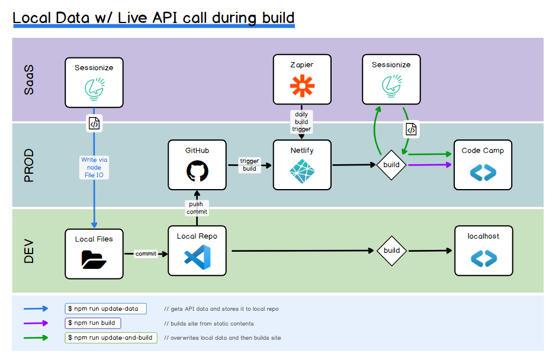

# VT Code Camp 2019 Website

[](https://app.netlify.com/sites/vtcodecamp2019/deploys)

* **Production site**: `https://www.vtcodecamp.com/`
* **Deploy Previews**: `https://deploy-preview-{PR#}--vtcodecamp2019.netlify.com/`
* **Branch Deploys**: `https://{branch-name}--vtcodecamp2019.netlify.com/`

## Built With

* [11ty/Eleventy](https://www.11ty.io) - static site generation
* [nunjucks](https://mozilla.github.io/nunjucks/) - templating
* [netlify](https://app.netlify.com/) - building / hosting
* [google fonts](https://fonts.google.com/?category=Monospace&selection.family=Inconsolata|PT+Sans|Ubuntu+Mono) - fonts
* [fontawesome icons](https://fontawesome.com/icons) - svg icons
* [unDraw](https://undraw.co/illustrations) -- illustrations

## Project Setup

* Install [Node.js & NPM](https://nodejs.org/en/download/)
* Run `npm install` in the project directory to install local dependencies
* Run `npm run serve` to run a local dev environment
* Access dev copy of the site at [localhost:8080](http://localhost:8080)

## NPM Scripts

```bash
npm run build             # runs `npx eleventy` to build the site
npm run serve             # builds site + serves `_site` directory
npm run update-data       # gets sessionize data and updates _data directory
npm run update-and-build  # gets new sessionize data and builds site
```

## Build Workflow / Interface Diagram



## File Structure

```bash
2019.vtcodecamp
├── _site/                # generated site output
├── .vscode/              # vs code editor configs
├── .netlify/             # netlify dev settings
├── node_modules/         # created by npm install
├── src
│   ├── _data             # data directory for 11ty (json + js)
│   │   ├── config.js     # environment settings
│   │   └── sponsor.js    # data driving sponsor section
│   ├── _includes         # template directory for 11ty
│   │   └── defaultLayout # parent template layout page
│   ├── assets            # static assets to build into site
│   │   └── sponsorLogos/ # sponsor logos
│   ├── [PageName].md     # any .md files will be built into html
│   ├── [PageName].njk    # any .njk files will be built into html
│   ├── favicon.ico       # favicon needs to be in root dir
│   └── index.njk         # home page
├── package.json          # lists npm modules, package, and scripts
├── .eleventy.js          # config information for 11ty
├── .gitignore            # ignored files in git
├── netlify.toml          # deploy settings for netlify
├── resources.md          # helpful links
└── readme.md             # 🟊 [You Are Here]
```

## YAML FrontMatter

Data can be added to the beginning of a page and leveraged in the templating process.  The following fields are commonly used by the layout page:

```yaml
---
layout: default-layout.njk
title:  page title and header element
meta_description: description will show up in meta tags
---
```

## Sponsor Logo Workflow

* Add sponsor info to `sponsors.json`
* Start with `scale:100` and run project locally, value can be adjusted (`70...150`) to maintain consistent visual weight in each category
* Logo should have an transparency channel for non-design elements (background)
  * If it doesn't, add an alpha channel, and remove background with magic selector using any of the following programs: 
    * [paint.net](https://www.getpaint.net/)
    * [gimp](https://www.gimp.org/)
    * [affinity designer](https://affinity.serif.com/en-us/designer/)
    * any other tools (lots available)
* Compress Image
  * Raster
    * Use [ImageOptim](https://imageoptim.com/mac), [Compressor.io](https://compressor.io/), or [Squoosh](https://squoosh.app/)
    * Whatever the screen resulting resolution, the logo should be resized down to double that resolution for retina displays
  * SVG
    * Use [SVGOmg](https://jakearchibald.github.io/svgomg/)
  * Note: At some point we may try to bake this into the build process if we can get node based CLIs for each optimization.  Netlify is setup to perform non-lossy [asset optimization](https://www.netlify.com/blog/2019/08/05/control-your-asset-optimization-settings-from-netlify.toml/), but there's still a lot of other more opinionated optimizations.

## Resources

Checkout [resources.md](resources.md) for a bunch of docs, links, google search results that helped get us to the point where we are today.  Often each resource links lives within the same commit where that feature was being worked on, so you can see a real example of how that snippet was actually implemented.

## Contributing

Thanks for your interest in contributing! There are many ways to contribute to this project.

Get started with [contributing.md](contributing.md)
