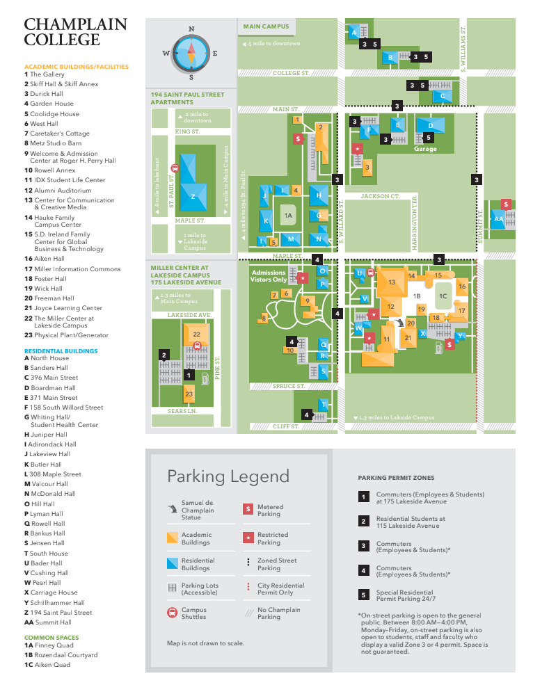

# Champlain College Parking Information

Vermont Code Camp is located in the Center for Communication & Creative Media (CCM), building 13 on the map below. Along with street parking, Vermont Code Camp parking is available on campus in Champlain College lots. Participants are welcome to park without a permit and free of charge in lots marked #3, #4, and $ (metered) on the attached parking map. We ask that you refrain from parking in the Admissions lot off Maple Street, marked on the map with an exclamation point (restricted).

We anticipate parking will be tight, so we encourage you to [walk](http://www.champlain.edu/current-students/campus-services/transportation-and-parking/walk), [bike](http://www.champlain.edu/current-students/campus-services/transportation-and-parking/bike), [bus](http://www.champlain.edu/current-students/campus-services/transportation-and-parking/bus), or carpool.

For speakers or sponsors who may need to load or unload equipment, you are welcome to pull into the service lot located off South Willard Street, between Maple and Spruce, in the lot marked with a star next to the CCM Building #13 on the attached map. There is an elevator across the entryway as you enter CCM through the nearest set of doors from the parking lot.

The Vermont Code Camp registration and welcome will take place in the Champlain Room located on the 3rd floor of the CCM Building.

